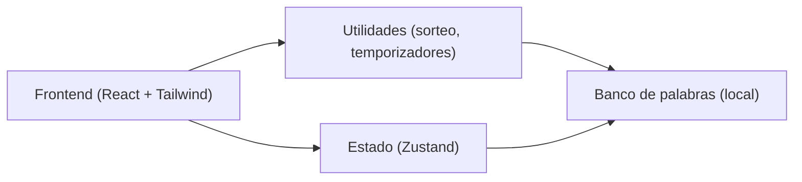
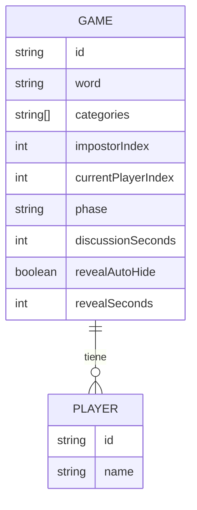

## 1. Diseño de Arquitectura

## 2. Descripción de Tecnologías
- Frontend: React@18 + TypeScript + tailwindcss@3 + Vite
- Gestión de estado: zustand (estado de partida y navegación interna)
- Backend: Ninguno (juego 100% local)
- Datos: listas de palabras en archivos TypeScript/JSON dentro del repo

## 3. Definición de Rutas
| Ruta | Propósito |
|------|-----------|
| / | Aplicación completa (pantallas internas: Configuración, Reparto/Reveal, Discusión) |

## 4. API (No aplica)
- No hay backend ni endpoints.

## 5. Modelo de Datos

### 5.1 Definición (conceptual)

### 5.2 Tipos (TypeScript)
- `WordEntry`: `{ value: string; categories: string[] }`
- `GamePhase`: `"setup" | "deal" | "discussion"`
- `GameState`:
  - `players: Player[]`
  - `phase: GamePhase`
  - `secretWord: string | null`
  - `impostorIndex: number | null`
  - `currentPlayerIndex: number`
  - `reveal`: `{ isRevealed: boolean; autoHide: boolean; seconds: number }`
  - `discussion`: `{ secondsTotal: number; secondsLeft: number; running: boolean }`
  - Acciones: `startGame()`, `nextPlayer()`, `resetReveal()`, `startDiscussion()`, `newRound()`, `setOptions()`
