## 1. Visión del Producto
Juego social local tipo “impostor” para móviles/PC: todos reciben una palabra secreta en español menos 1 impostor. Pensado para jugar en una sola pantalla pasando el dispositivo.
- Propósito: facilitar rondas rápidas, reparto de roles sin trampas y reinicio inmediato
- Valor: diversión grupal sin necesitar registro, internet ni cuentas

## 2. Funcionalidades Principales

### 2.1 Roles de Usuario
| Rol | Método de acceso | Permisos principales |
|-----|------------------|----------------------|
| Jugador/Anfitrión | Sin registro | Configurar partida, revelar rol, iniciar discusión, reiniciar |

### 2.2 Módulos por Pantalla
1. **Inicio/Configuración**: número de jugadores, selección de categorías, tamaño de lista, opción de nombres, botón “Empezar”
2. **Reparto/Reveal**: turnos por jugador, pantalla de seguridad “toma el dispositivo”, revelar rol (palabra o impostor), ocultar y pasar al siguiente
3. **Discusión/Votación (ligero)**: temporizador configurable, lista de jugadores para “marcar sospechoso” (opcional), botón “Nueva ronda”

### 2.3 Detalle de Pantallas
| Pantalla | Módulo | Descripción |
|----------|--------|-------------|
| Inicio/Configuración | Jugadores | Campo para número de jugadores (mín. 3), opcional: nombres (lista editable) |
| Inicio/Configuración | Palabras | Categorías (multi-selección), selector de “dificultad” (lista básica vs. extendida) |
| Inicio/Configuración | Reglas | Toggle: “Mostrar la palabra solo X segundos” y “Ocultar automáticamente” |
| Reparto/Reveal | Seguridad | Pantalla para evitar miradas: “Jugador N, toma el dispositivo” + botón “Revelar” |
| Reparto/Reveal | Revelado | Muestra “IMPOSTOR” o “Tu palabra: ___”, con temporizador visual si está habilitado |
| Reparto/Reveal | Paso | Botón “Ocultar y pasar” que borra la palabra en pantalla |
| Discusión/Votación | Temporizador | Cuenta regresiva con play/pause/reset y duración predefinida (p. ej. 2–5 min) |
| Discusión/Votación | Voto rápido | Lista con selección única (quién sospechas) sin cálculo de ganador (solo ayuda al grupo) |
| Discusión/Votación | Reinicio | “Nueva ronda” mantiene jugadores/categorías, re-sortea palabra e impostor |

## 3. Flujo Principal
1. El anfitrión define jugadores, categorías y opciones de seguridad.
2. Se genera una palabra aleatoria en español y se elige 1 impostor al azar.
3. Se hace el reparto: cada jugador revela su rol individualmente y se oculta antes de pasar.
4. El grupo discute con temporizador.
5. Se puede iniciar una nueva ronda con los mismos ajustes.

```mermaid
flowchart TD
  A["Inicio / Configuración"] --> B["Generar palabra e impostor"]
  B --> C["Turno jugador: pantalla de seguridad"]
  C --> D["Revelar rol (palabra o impostor)"]
  D --> E["Ocultar y pasar al siguiente"]
  E -->|Quedan jugadores| C
  E -->|Último jugador| F["Discusión (temporizador)"]
  F --> G["Nueva ronda (re-sorteo)"]
  G --> C
```

## 4. Diseño de Interfaz
### 4.1 Estilo Visual
- Paleta: base oscura (zinc/black) con acentos “lima” y “fucsia” para estados (seguro / revelar / impostor)
- Tipografía: display contundente para títulos y una sans legible para controles
- Componentes: tarjetas grandes, botones “tap-friendly”, estados muy claros (seguro vs revelado)
- Microinteracciones: transiciones suaves, contador circular/lineal para el reveal y el temporizador

### 4.2 Resumen de UI por Pantalla
| Pantalla | Módulo | Elementos de UI |
|----------|--------|-----------------|
| Inicio/Configuración | Formulario | Cards con inputs grandes, toggles, chips de categorías, CTA “Empezar” destacado |
| Reparto/Reveal | Seguridad | Pantalla full-bleed, texto grande “Jugador N”, botón único “Revelar” |
| Reparto/Reveal | Revelado | Palabra centrada, badge “IMPOSTOR”, botón “Ocultar y pasar”, temporizador visual |
| Discusión/Votación | Temporizador | Contador grande, controles play/pause/reset, CTA “Nueva ronda” |

### 4.3 Responsividad
- Enfoque desktop-first, adaptado a móvil (botones grandes, espaciado cómodo, texto escalable)
- Soporte “pasar el dispositivo”: evita scroll en pantallas críticas (seguridad/reveal)
